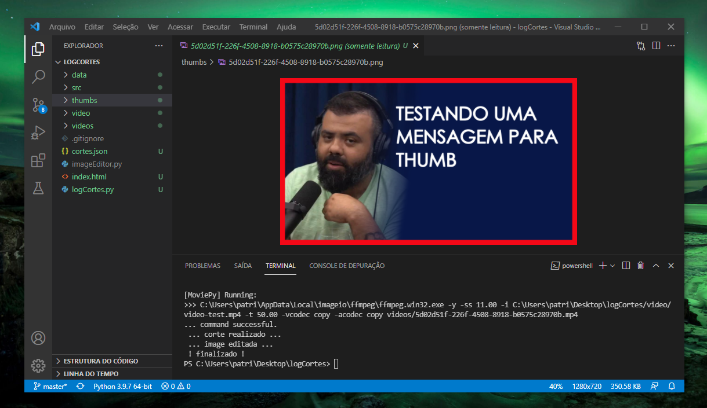
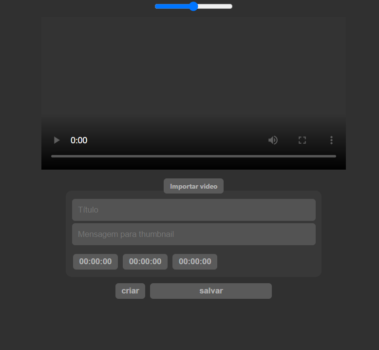

# logCortes



Ferramenta para criar e organizar cortes em videos, iniciado por patrick-mns. Crie seus cortes e thumbnail de forma semi-automática. Feita com  Python e Javascript. *A ferramenta foi criada para estudo. Divirta-se aprimorando o código.*

Exemplo de entrada de dados json:
```
{
    "data": [
        {
            "id": "5fdb79e8-092a-4cd4-b296-49293f0899e4",
            "pointA": 8,
            "pointB": 80,
            "pointT": 74,
            "title": "Titulo do video",
            "message": "Uma frase para thumb"
        }
    ]
}
```

`pointA` timer do começo do video em segundos (começa em)

`pointB` timer do final do video em segundos (termina em) 

`pointT` timer para captura de imagem da thumbnail em segundos (thumbnail em)

            
### Painel de marcações 
É onde suas marcações são realizadas usando inputs de tempo. Foi criado para ser o mais simples possível. A sequência dos botões inputs de tempo é: começa em, termina em, thumbnail em. Para adicionar ou modificar o tempo dos inputs basta clicar. O botão criar ira armazenar em tela o seu corte que pode ser removido ao clicar nele ou posteriormente salvo em arquivo cortes.json, ou enviado ao banco de dados para ser passado ao script Python. Aqui você também deve escolher um título para o seu video e uma mensagem que irá escrita na thumbnail.




## Dependências

**moviepy==0.2.3.2** <br>
**Pillow==8.2.0**

## Diretórios

**data/** é responsavel por guardar todos os arquivos de captura de frame do video. <br>
**src/** é responsavel  por guardar todos os arquivos para masclagem de imagens e pré montagem. <br>
**thumbs/** é responsavel por guardar todas as thumbs de video. <br>
**video/** é responsavel por guardar o video original para edição (será sempre considerado o primeiro video da pasta). <br>
**videos/** é responsavel por guardar todos os cortes prontos para envio. <br>

